# GD_Technician

DG Technician is an online technician appointment application that is used to book appointments with technicians like Electricians, Plumbers, Painters etc. Users will have the option to get the user's through categories from all the available technicians. Users can see technician details call them, message with technician through the application, and then book an appointment.

User can book appointment dates and time slots according to their own choice and provide details for that specific appointment.

Here is a complete overview of the DG Technician application:

<b>1) Splash Screen</b>

  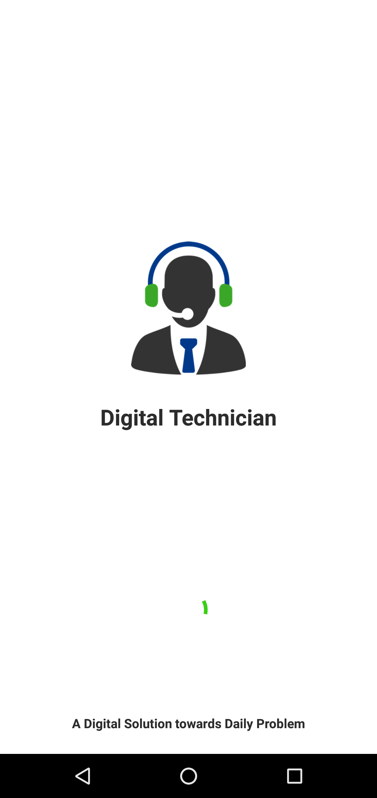

<b>2) Get Started Screen</b>

  

<b>3) LogIn Screen</b>

  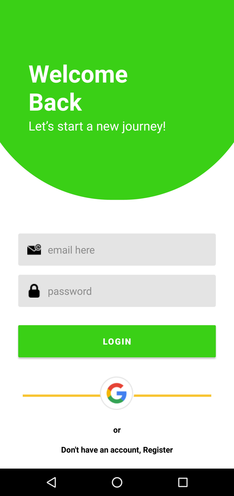

<b>4) SignUp Screen</b>

  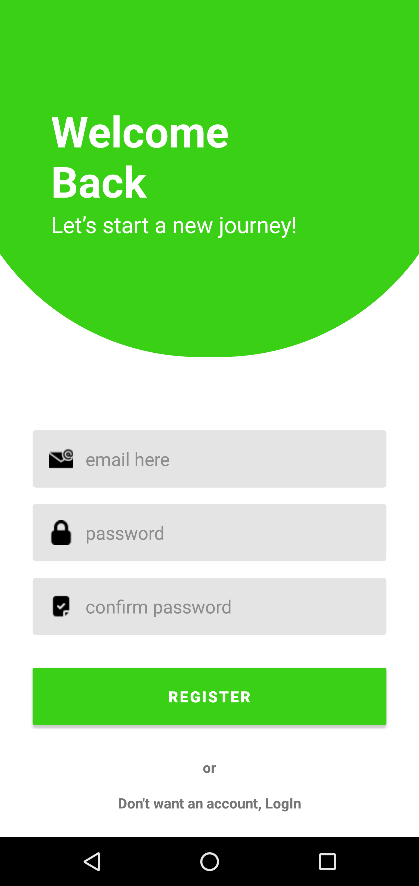

<b>5) OnBoard Screens</b>

  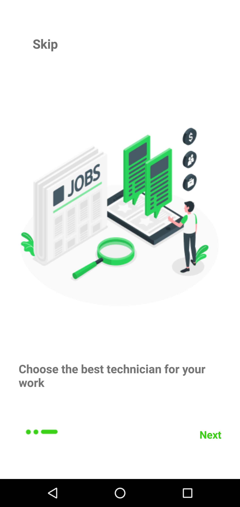

    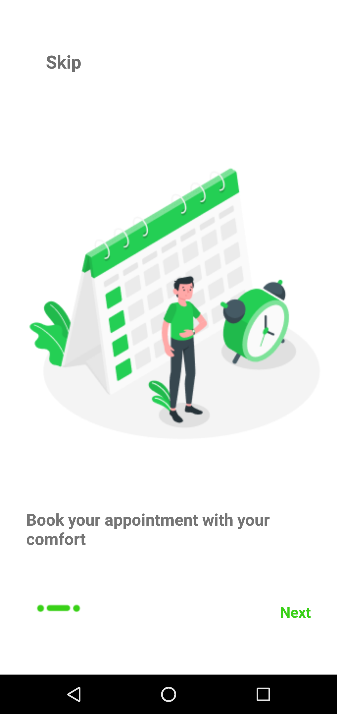

    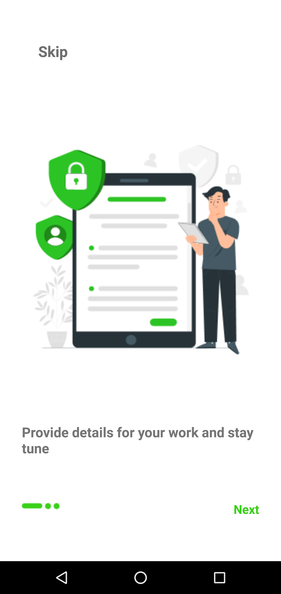

<b>6) Home Screen</b>

  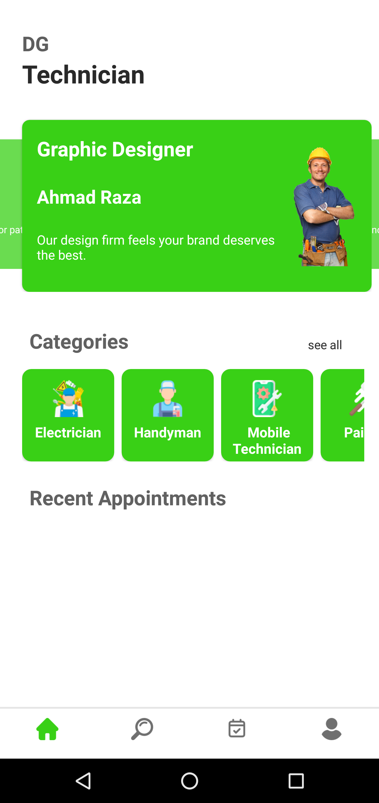

<b>7) Details Screen Screen</b>

  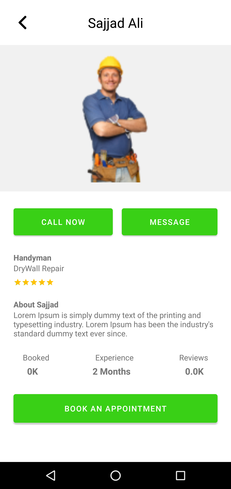

<b>8) Chat Screen</b>

  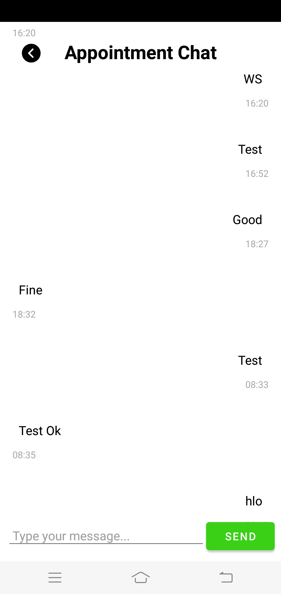

<b>9) Make Appointment</b>

  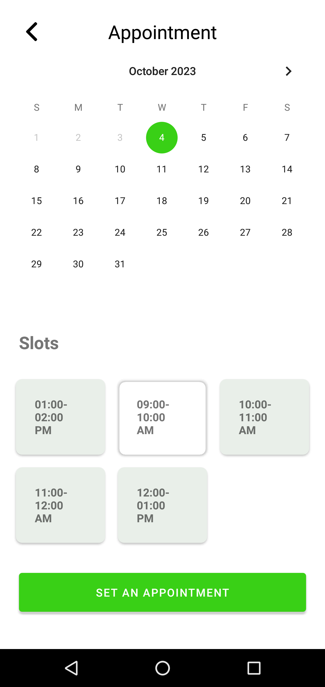

<b>10) Conform Appointment</b>

  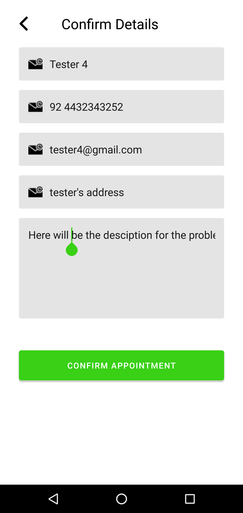

<b>11) Requested Appointment</b>

  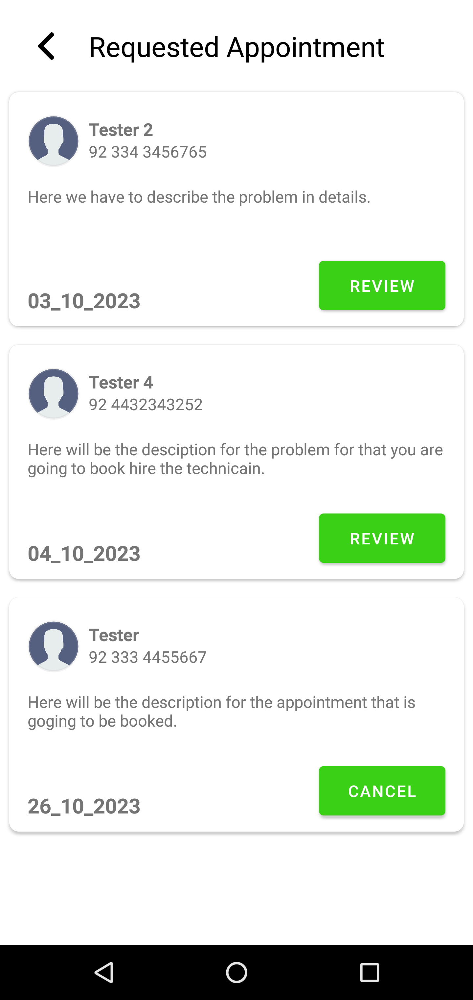

<b>12) Booked Appointment</b>

  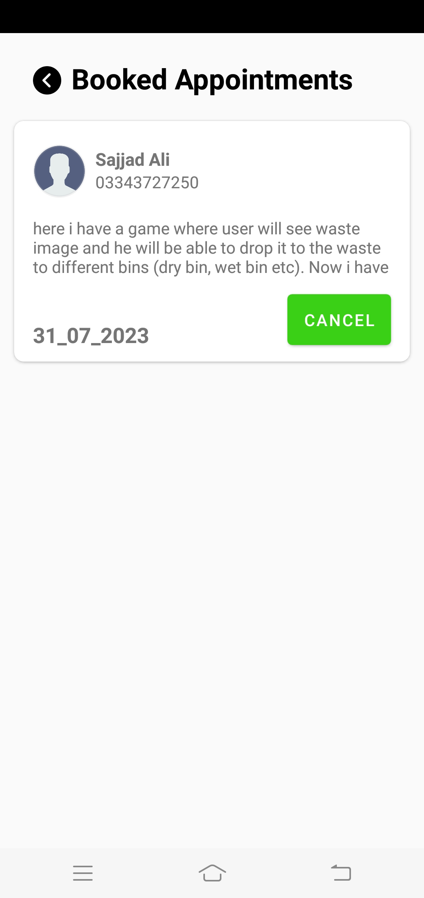

<b>13) Rating Screen</b>

  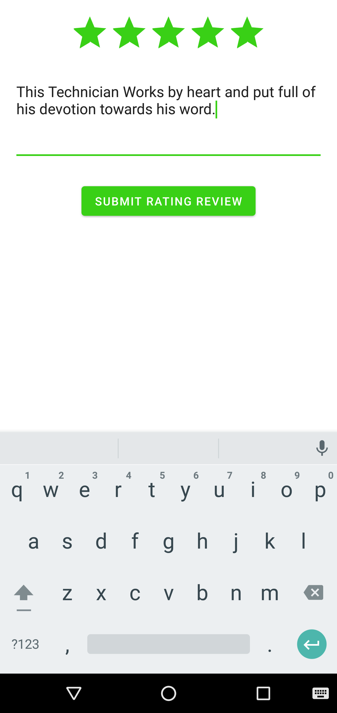

<b>14) Search Appointment</b>

  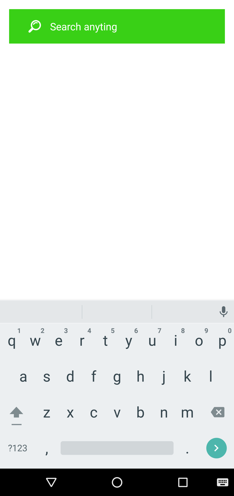

<b>Application Features:</b>

<ol>
  <li>Fragments(NavHost Fragments</li>
  <li>Navigation Graph</li>
  <li>Firebase Authentication</li>
  <li>Firebase Firestore & Realtime Datebase</li>
  <li>NVVM Architechture</li>
  <li>Glige Liabrary</li>
  <li>Attractive UI/UX</li>
</ol>
